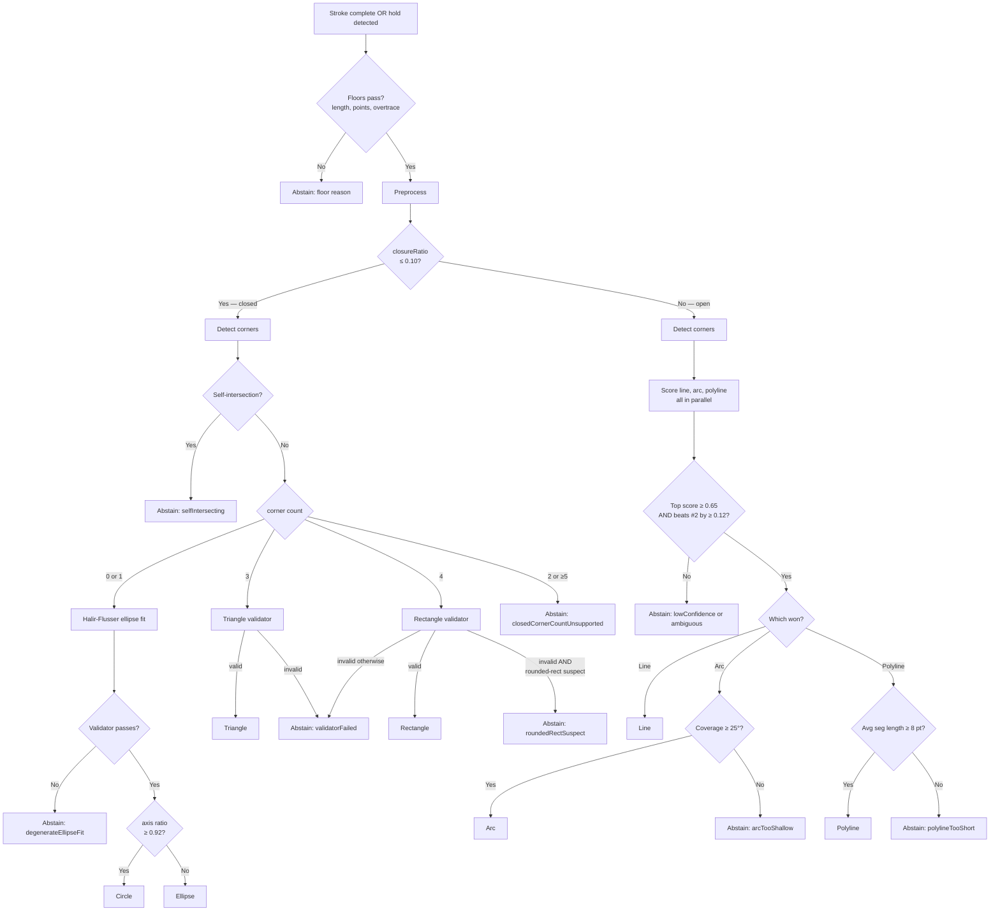
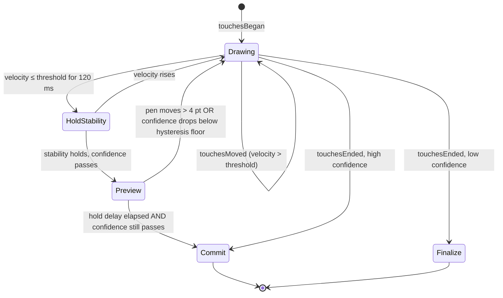

# QuickShape-Like Stroke Recognizer for Kiki — v5 Plan

**Status:** Implementation plan, partially stubbed.
**Authors:** Claude (architecture, Swift), with researcher TODOs called out inline.
**Supersedes:** four prior research-team drafts (referred to as v1–v4 below). Where this document conflicts with prior drafts, this document wins.

This plan is the union of what's been agreed across iterations plus the substantive sections that prior drafts kept omitting (worked stroke gallery, reference Swift kernel, brush-engine integration, failure-mode table, etc.). Sections marked **`TODO[researcher]`** are deliberately stubbed — they require either verification against original source papers, hands-on evaluation of competing apps/libraries, or empirical data we don't yet have. Each TODO specifies what the deliverable should look like.

---

## Table of contents

1. [Goal & scope](#1-goal--scope)
2. [Architecture overview](#2-architecture-overview)
3. [Preprocessing pipeline](#3-preprocessing-pipeline)
4. [Feature extraction](#4-feature-extraction)
5. [Fitting algorithms](#5-fitting-algorithms)
6. [Decision logic & abstain framework](#6-decision-logic--abstain-framework)
7. [Seed-value reference table](#7-seed-value-reference-table)
8. [Worked stroke gallery](#8-worked-stroke-gallery)
9. [Failure-mode catalog](#9-failure-mode-catalog)
10. [Brush-engine integration (Kiki-specific)](#10-brush-engine-integration-kiki-specific)
11. [UX interaction model](#11-ux-interaction-model)
12. [Performance budget](#12-performance-budget)
13. [Reference Swift kernel](#13-reference-swift-kernel)
14. [Numerical pitfalls & robustness](#14-numerical-pitfalls--robustness)
15. [Forward compatibility](#15-forward-compatibility)
16. [Engineering checklist](#16-engineering-checklist)
17. [Test plan & telemetry](#17-test-plan--telemetry)
18. [Consolidated researcher TODOs](#18-consolidated-researcher-todos)
19. [References](#19-references)
20. [Resolved research notes](#20-resolved-research-notes)

---

## 1. Goal & scope

Add Procreate-QuickShape-like stroke beautification to Kiki's Metal canvas: when the user draws a single stroke and **holds at the end**, the recognizer snaps the stroke to the nearest plausible primitive (line, arc, polyline, ellipse, circle, triangle, rectangle) — **or abstains** if no primitive is a confident match. Editing the snapped shape is out of scope for v1; raw-stroke fallback via single-step undo is in scope.

### Primitives in scope (v1)

| Primitive | Topology | Local character | Notes |
|---|---|---|---|
| Line | open | smooth | endpoints projected onto fitted line |
| Arc (circular) | open | smooth | derived from circle fit + angular sweep |
| Polyline | open | cornered | segment per detected corner, line-fit each |
| Ellipse | closed | smooth | Halír–Flusser stabilized fit |
| Circle | closed | smooth | promotion of near-equal-axis ellipse |
| Triangle | closed | cornered | 3 stable corners + edge-line validation |
| Rectangle | closed | cornered | 4 stable corners + parallelism + right-angle validation |
| **Abstain** | either | any | leave raw stroke unchanged |

### Out of scope for v1
- Rounded rectangles (explicit reject; future)
- Arbitrary regular polygons (hexagon, pentagon)
- S-curves and free-form Bézier correction
- Multi-stroke shape fusion ("these 4 strokes together form a square")
- Snap-to-existing-geometry alignment
- Symmetry-axis snapping
- Edit-Shape post-commit handles (Procreate's Edit Shape mode)
- "Perfect form" two-finger modifier (Procreate's circle-from-ellipse upgrade)

### Design priority order
1. **False-snap rate before recognition accuracy.** A missed snap is forgivable; a wrong snap "feels hostile."
2. **Latency:** preview must appear within 80 ms of the hold being recognized; commit within 50 ms of the hold delay elapsing.
3. **Brush expressiveness:** corrected strokes must preserve original per-stamp pressure/tilt/azimuth, not flatten to monoline.
4. **Determinism:** same input stroke → same verdict, every time. No randomized fitters in v1 (no RANSAC).

### Constraints from Kiki's existing architecture
- iPad-only (Apple Pencil + finger). Coalesced touches available at up to 240 Hz; UIKit delivery typically 60–120 Hz.
- Metal stamp-based brush engine (`CanvasRenderer`, `MetalCanvasView`). Active stroke rendered into `scratchTexture`, flattened into the active layer on `touchesEnded`. See `ios/Packages/CanvasModule/CLAUDE.md`.
- Stroke geometry currently lives only in the `StampInstance` buffer that gets flattened — there is **no preserved point list** post-commit. The recognizer needs the raw `StrokePoint` array (position + pressure + altitude + azimuth + timestamp) kept around through the hold window.
- Undo is via per-layer texture snapshots (depth 30); a snap commit replaces one undo unit.
- Color/space rules in `CanvasModule/CLAUDE.md` are non-negotiable. The recognizer doesn't touch color, but the preview overlay must respect them.

---

## 2. Architecture overview

### 2.1 Module layout

A new `StrokeRecognizerModule` (Swift package) sibling to `CanvasModule`. Pure logic, no UIKit/Metal dependency — testable headlessly. Communicates with `CanvasModule` via:

- **Input:** `recognizer.feed(point: StrokePoint)` called from `MetalCanvasView.touchesMoved` on every coalesced point.
- **Hold detection:** recognizer raises a `HoldDetected` callback when stylus velocity stays under threshold for the stability window. `MetalCanvasView` decides whether to honor it (e.g. ignores during lasso/eraser).
- **Preview commit:** recognizer returns a `Verdict` enum (`.line(LineGeometry)`, `.arc(ArcGeometry)`, …, `.polyline(PolylineGeometry)`, `.abstain(reason: AbstainReason)`).
- **Commit acceptance:** `MetalCanvasView` (or `CanvasViewModel`) is responsible for replacing the scratch-texture stamp buffer with one regenerated from the corrected geometry. See [§10](#10-brush-engine-integration-kiki-specific).

### 2.2 Decision tree

Open strokes always score **all three** candidates (line, arc, polyline) and pick by margin — even with one corner. (An L-shape has one corner but is a valid 2-segment polyline; gating polyline behind `cornerCount ≥ 2` would lose it.) Polyline scores 0 when there are no corners, so it never wins on a smooth stroke.



### 2.3 Public API surface

Concrete Swift API the engineering team will implement. Pinning this down now prevents drift between the recognizer module and `CanvasModule`.

```swift
// In StrokeRecognizerModule (new package, no UIKit/Metal deps).

public final class StrokeRecognizer {
    public init(seeds: RecognizerSeeds = .default)

    /// Reset internal state. Call on touchesBegan.
    public func reset()

    /// Feed one input point. Call on every coalesced touch in touchesMoved.
    /// Updates cheap incremental features (O(1) per call).
    public func feed(point: StrokePoint)

    /// Returns the current best Verdict speculatively, given the points so far.
    /// Throttled internally to seeds.speculativeFitHz; returns cached verdict
    /// between full re-fits. Safe to call on every touch.
    public func currentVerdict() -> Verdict

    /// Final classification — runs the full pipeline once. Call on touchesEnded
    /// or when committing a hold.
    public func finalize() -> Verdict

    /// True if velocity has been below seeds.holdVelocityThreshold for at
    /// least seeds.holdStabilityWindow. The state machine in CanvasModule
    /// drives Preview/Commit timing from this.
    public var isHolding: Bool { get }

    /// Current top-candidate confidence in [0, 1]. For UI hysteresis.
    public var currentConfidence: CGFloat { get }
}

/// Pure value type — fed to the recognizer; carries everything needed for
/// brush replay too.
public struct StrokePoint: Equatable {
    public let position: CGPoint     // canvas space
    public let pressure: CGFloat     // [0, 1]
    public let altitude: CGFloat     // radians
    public let azimuth: CGFloat      // radians
    public let timestamp: TimeInterval
}

public enum Verdict: Equatable {
    case line(LineGeometry)
    case arc(ArcGeometry)
    case polyline(PolylineGeometry)
    case ellipse(EllipseGeometry)
    case circle(CircleGeometry)
    case triangle(TriangleGeometry)
    case rectangle(RectangleGeometry)
    case abstain(AbstainReason)

    public var isSnap: Bool {
        if case .abstain = self { return false } else { return true }
    }
}

public struct RecognizerSeeds {
    // Routing
    public var closureGate: CGFloat = 0.10
    // Acceptance
    public var acceptScore: CGFloat = 0.65
    public var abstainMargin: CGFloat = 0.12
    public var confidenceHysteresis: CGFloat = 0.05
    // Hold detection
    public var holdStabilityWindow: TimeInterval = 0.120
    public var holdCommitDelay: TimeInterval = 0.450
    public var holdVelocityThreshold: CGFloat = 30   // pt/s
    public var previewMoveCancelDist: CGFloat = 4    // pt
    // Pipeline
    public var speculativeFitHz: Double = 30
    public var targetSpacingFraction: CGFloat = 1.0 / 50
    public var minTargetSpacing: CGFloat = 2          // pt
    public var smoothingWindow: Int = 5
    // Floors
    public var minPathLength: CGFloat = 16            // pt
    public var minResampledPoints: Int = 12
    public var overtraceTurnMax: CGFloat = 2.5 * .pi
    // Arc
    public var arcCoverageMin: CGFloat = 25           // deg
    // Circle promotion
    public var circleAxisRatioMin: CGFloat = 0.92
    // Endpoint hook trim
    public var endpointTrimAngleDeg: CGFloat = 30
    public var endpointTrimLengthRatio: CGFloat = 0.05
    // Polygon validators (see §5.5–§5.6)
    public var triangleMinAngleDeg: CGFloat = 15
    public var triangleMaxAngleDeg: CGFloat = 150
    public var triangleClosingGapRatio: CGFloat = 0.15
    public var rectangleMaxParallelDevDeg: CGFloat = 12
    public var rectangleMaxRightAngleDevDeg: CGFloat = 15
    public var rectangleMaxAspect: CGFloat = 8
    // Corner finder (§5.4)
    public var strawWindow: Int = 3
    public var strawThresholdMultiplier: CGFloat = 0.95
    public var strawMergeRatio: CGFloat = 0.05
    public var strawEndpointTrimRatio: CGFloat = 0.05
    public var strawCurveSuppressTurnDeg: CGFloat = 35
    public var strawCurveSuppressSagittaRatio: CGFloat = 0.05

    public static let `default` = RecognizerSeeds()
}
```

The recognizer is **stateful** (it accumulates points and incremental features) but **pure** in the sense of having no I/O dependencies. All seeds are injected so they can be hot-reloaded in debug builds and A/B tested in release builds.

### 2.4 Lifecycle state machine



Key rules:
- Preview can appear and disappear during the hold window without committing. Once it commits, the snap is final (only undo reverses it).
- A stroke can also commit on `touchesEnded` if confidence is already high — no hold required for clear cases. (TODO[researcher]: validate this UX choice against Procreate; my read is they require the hold even for obvious shapes, but worth confirming.)
- During lasso/eraser tool, recognizer is bypassed entirely.

---

## 3. Preprocessing pipeline

Three parallel point streams during a stroke:

| Stream | Source | Used for |
|---|---|---|
| **Raw** | every `UITouch` (delivered + coalesced) with `force`, `altitudeAngle`, `azimuthAngle`, `timestamp` | brush rendering, undo, post-commit replay |
| **Classification copy** | raw points → dedupe → arc-length resample → light smooth | recognizer features and fits |
| **Predicted** | `event.predictedTouches(for:)` | display-only stamp interpolation; **never** fed to recognizer |

All lengths in this section are in **canvas-space points (pt)** unless otherwise marked.

### 3.1 Dedupe, resample, smooth

**Dedupe.** Drop consecutive raw points whose Euclidean distance is < 0.5 pt. Prevents divide-by-zero in tangent computation; rare but happens on stationary coalesced touches.

**Resample.** Arc-length resample to **target spacing = max(bbox_diagonal / 50, 2 pt)**. Bbox-relative spacing keeps point counts roughly constant (~50 ± 30) across stroke sizes; the 2 pt floor prevents sub-pixel oversampling on tiny strokes.

Output is a `[ResampledPoint]` with position only (pressure/tilt are tracked on raw points; the recognizer only needs geometry).

Implementation: standard cumulative-arc-length walk with linear interpolation between raw points. ~100 µs for 200 raw points.

**Smooth.** 5-tap centered moving average on the resampled copy. Endpoints kept verbatim (no smoothing on first/last sample). Enough to settle tangent jitter without erasing ~5° corner features.

Heavier smoothing (Gaussian, Savitzky–Golay) is **not** used — it begins to flatten genuine sagitta on shallow arcs, which is exactly what we need to discriminate line vs arc.

### 3.2 Endpoint hook trim

Apple Pencil strokes often have a 1–3 sample "hook" at the lift-off end (the pencil drags as it leaves the screen). PaleoSketch trims these. Heuristic, applied to **both** ends of the classification copy:

- For the trailing end: if the last 3 resampled samples turn cumulatively > 30° relative to the prior tangent **and** their total length is < 5% of total path length, drop them from the classification copy only. The raw stroke is untouched (so the brush still shows the user's actual lift-off).
- For the leading end: mirror — same rule on the first 3 samples relative to the next-tangent.

(TODO[researcher]: cross-check trim thresholds against PaleoSketch §3.1. Our values are reasonable but not from source.)

### 3.3 Normalization scale

`strokeScale = max(bboxDiagonal, ε)`. All residuals are normalized by this so thresholds are zoom-invariant.

---

## 4. Feature extraction

All features below are computed from the **classification copy** (resampled, smoothed, endpoint-hook-trimmed).

| Feature | Formula | Cost | Used by |
|---|---|---|---|
| `pathLength` | `Σ ‖p_{i+1} − p_i‖` | O(n) incremental | every branch |
| `endpointGap` | `‖p_N − p_0‖` | O(1) | closure |
| `closureRatio` | `endpointGap / pathLength` | O(1) | open/closed gate |
| `bboxDiagonal` | `‖bbox.size‖` | O(n) incremental | scale normalization |
| `chordLength` | same as `endpointGap` | O(1) | sagitta |
| `sagittaRatio` | `max_i d⊥(p_i, chord) / chordLength` | O(n) | line vs arc |
| `totalSignedTurn` | `Σ atan2(v_i × v_{i+1}, v_i · v_{i+1})` | O(n) incremental | ellipse coverage, sign consistency |
| `totalAbsTurn` | `Σ |signedAngle_i|` | O(n) incremental | line/arc/polyline |
| `signRatio` | `|sumPositiveTurn − sumNegativeTurn| / max(sumAbsTurn, ε)` | O(n) | arc vs polyline |
| `lineNormRMS` | `rms(ortho line residuals) / strokeScale` | O(n) + 2×2 eigen | line score |
| `circleNormRMS` | `rms(\|‖p−c‖−r\|) / strokeScale` | O(n) + algebraic fit | arc score |
| `arcCoverageDeg` | `unwrappedAngle(p_N) − unwrappedAngle(p_0)` around fitted center | O(n) | arc validity |
| `cornerIndices` | ShortStraw + curve-aware suppression (§5.4) output | O(n) | polyline / closed branch |
| `stableCornerCount` | `cornerIndices.count` after merge & trim | O(1) | branch routing |

Where `signRatio`:
- ≈ 1.0 = stroke turns consistently one direction (arc-like)
- ≈ 0.5 = stroke turns roughly equally both ways (polyline or noise)
- ≈ 0.0 = perfectly balanced wiggle

### 4.1 Incremental vs batch

Cheap features (`pathLength`, `endpointGap`, `closureRatio`, `bboxDiagonal`, `totalSignedTurn`, `totalAbsTurn`) update on every coalesced touch — O(1) per point.

Expensive features (`lineNormRMS`, `circleNormRMS`, `arcCoverageDeg`, ellipse fit, corner detection) run only:
- At most 30× per second during the hold window (speculative re-evaluation).
- Once at `touchesEnded`.
- Once on hold commit.

---

## 5. Fitting algorithms

### 5.1 TLS line fit
Total least squares via 2×2 covariance eigendecomposition of centered points. Equivalent to PCA on the 2D point cloud. Produces `(centroid, unit direction)`. Endpoints are then projected from the **raw** first/last point onto the fitted line — never returned as the algebraic line extents (per PaleoSketch). Full Swift in [§13.1](#131-tls-line-fit).

### 5.2 Algebraic circle fit (Taubin)

**Resolved (was: Pratt vs Taubin TODO).** Use **Taubin's method**.

Justification: published comparisons (Al-Sharadqah & Chernov 2009, *Error Analysis for Circle Fitting Algorithms*; Chernov 2010, *Further Statistical Analysis of Circle Fitting*) report that Taubin's bias is roughly half of Pratt's and quarter of Kåsa's. Taubin is also explicitly noted as "robust and accurate even when data points are observed only within a small arc" — exactly our regime. Both Taubin and Pratt are single-shot algebraic fits with comparable runtime; the modest accuracy edge favors Taubin.

Algorithm:
1. Center the points: `(x_i, y_i) → (x_i − cx, y_i − cy)` where `(cx, cy)` is the centroid.
2. Compute moments `Mxx, Myy, Mxy, Mxz, Myz, Mzz` where `z_i = x_i² + y_i²`.
3. Solve a small generalized eigenproblem (Newton iteration on the characteristic polynomial converges in 1–2 steps from a good initial guess).
4. Recover algebraic conic coefficients, convert to `(center, radius)`.

Output: `(center, radius)`. Residual = `rms(|‖p_i − center‖ − radius|)`.

Coverage angle: walk the points in stroke order, compute `atan2(p_i.y − c.y, p_i.x − c.x)`, unwrap (handle the −π/+π discontinuity), report `|θ_N − θ_0|`.

Reference implementation to mirror: Chernov's MATLAB `TaubinSVD` is the canonical version (~30 lines). See https://people.cas.uab.edu/~mosya/cl/ for source code. Port to Swift via Accelerate's SVD (`LAPACK dgesvd_`).

### 5.3 Halír–Flusser ellipse fit

**Verified against scipython.com's reference implementation of Halír & Flusser 1998** (which mirrors the original WSCG paper's algorithm). Equations below are confirmed correct.

Direct least-squares ellipse fit (Fitzgibbon, Pilu, Fisher 1999) is the right algorithm for closed strokes, but the original formulation builds a 6×6 design matrix whose constraint matrix is rank-deficient — naive eigensolves return junk. Halír & Flusser (1998) reformulate it as a stable 3×3 reduced eigenproblem.

**Algorithm:**

1. **Normalize** points to unit scale around centroid: `(x, y) → ((x − cx) / s, (y − cy) / s)` where `s = bboxDiagonal / 2`. Critical for numerical stability.

2. **Build design submatrices.** For each point `(x, y)`:
   - `D1` row: `[x², xy, y²]` — quadratic terms
   - `D2` row: `[x, y, 1]` — linear/constant terms

3. **Build scatter blocks (each 3×3):**
   - `S1 = D1ᵀ · D1`
   - `S2 = D1ᵀ · D2`
   - `S3 = D2ᵀ · D2`

4. **Constraint matrix** (note: this is `C` itself, not its inverse):
   ```
   C = [[ 0,  0,  2],
        [ 0, -1,  0],
        [ 2,  0,  0]]

   C⁻¹ = [[ 0,   0,  1/2],
          [ 0,  -1,    0],
          [ 1/2, 0,    0]]
   ```

5. **Reduced eigenproblem.** Compute `T = −S3⁻¹ · S2ᵀ` (3×3), then
   ```
   M = C⁻¹ · (S1 + S2 · T)
   ```
   (Equivalent to `M = C⁻¹ · (S1 − S2 · S3⁻¹ · S2ᵀ)`, just bookkeeping the negative differently. The scipython reference implementation uses the `T` formulation, which is convenient because `T` is reused in step 6.)

   Solve the standard 3×3 eigenproblem of `M`: get three (eigenvalue, eigenvector) pairs.

6. **Pick the eigenvector** for which `4·v[0]·v[2] − v[1]² > 0` (the ellipse-specific constraint; exactly one of the three eigenvectors satisfies this for valid input). Call this eigenvector `a1 = (A, B, C)`.

7. **Recover the rest.** `a2 = (D, E, F) = T · a1`. The full conic is `[A, B, C, D, E, F]`.

8. **Convert conic → geometric** (center `(h, k)`, semi-axes `(a, b)`, rotation `θ`). Verified formulas (scipython.com):
   ```
   denom = B² − A·C            // note sign: B² − AC, NOT 4AC − B²
   h = (C·D − B·F/2) / denom
   k = (A·F − B·D/2) / denom

   num = 2·(A·E² + C·D² − B·D·E + (B² − A·C)·F)
   common = sqrt((A − C)² + B²)
   a = sqrt(num / (denom · ((A + C) + common)))
   b = sqrt(num / (denom · ((A + C) − common)))
   semiMajor = max(a, b)
   semiMinor = min(a, b)

   θ = 0.5 · atan2(B, A − C)   // rotation of semi-major from +x
   ```
   (My prior reconstruction had `denom = B² − 4AC` and `h = (2CD − BE) / denom`. Both forms appear in the literature with different scaling conventions for `[D, E, F]`. The form above is consistent with scipython's reference Python code, which matches the WSCG'98 paper's normalization.)

9. **Denormalize:** scale `a, b` by `s`; translate `(h, k)` by `(cx_orig, cy_orig)`.

10. **Validate.** Reject if:
    - `S3` is near-singular at step 5 (smallest singular value of `S3` < `1e-6 · largest`);
    - no eigenvalue satisfied the ellipse constraint at step 6;
    - any of `a, b, h, k` is NaN/Inf;
    - `b/a < 0.05` (degenerate sliver — likely a noisy line);
    - `max(a, b) > 2 · bboxDiagonal` (fit blew up);
    - center `(h, k)` is more than `bboxDiagonal` outside the stroke's bounding box.

When validation fails: `Abstain(.degenerateEllipseFit)`.

**Reference implementation:** scipython.com's blog post *Direct linear least squares fitting of an ellipse* — a complete, ~50-line Python implementation that maps directly to Swift via Accelerate's LAPACK bindings. https://scipython.com/blog/direct-linear-least-squares-fitting-of-an-ellipse/

### 5.4 ShortStraw + curve-aware suppression (IStraw-inspired)

**Partial verification.** ShortStraw (Wolin et al. 2008) is well documented in secondary sources: window `W = ±3`, line test threshold `0.95`, and a recursive corner-insertion step are confirmed. IStraw (Xiong & LaViola, *Computers & Graphics* 2010, building on their SBIM 2009 paper *Revisiting ShortStraw*) extends ShortStraw with a curve-aware angle test, but the IStraw paper is paywalled and its specific parameter values were chosen empirically and are not reproduced in any public secondary source we located. **The implementation below is ShortStraw with our own curve-aware suppression rule, calibrated independently.** It is "IStraw-inspired" rather than literal IStraw.

**Algorithm:**

1. **Resample** to bbox-relative spacing (already done in [§3.1](#31-resampling)).
2. **Compute straws.** For `i ∈ [w, n−w]`, `straw_i = ‖p_{i−w} − p_{i+w}‖`. Window `w = 3` (per ShortStraw).
3. **Threshold.** `t = 0.95 · median(straw)`. Mark each `i` with `straw_i < t` as a corner candidate. (ShortStraw uses median; the 0.95 multiplier is a tuning seed.)
4. **Local-min refinement.** Within a window of `±w` around each candidate, keep only the index with the smallest straw value.
5. **Recursive line-test (ShortStraw).** For each pair of consecutive candidates `(i, j)`, check whether `‖p_i − p_j‖ / pathLength(i, j) > 0.95`. If yes, the segment is straight (no missed corner). If no, find the index in `(i, j)` with smallest straw and add it as a candidate. Recurse with a slightly looser threshold (`0.93`, `0.91`, ...) until either every segment passes or the threshold falls below `0.85`.
6. **Merge close corners.** Drop candidates within `pathLength * 0.05` of each other (keep the one with smaller straw).
7. **Trim endpoint corners.** Drop corners within the first or last 5% of resampled points (these are usually start/end hooks).
8. **Curve-aware suppression (our addition, IStraw-spirit).** For each surviving candidate index `i`, compute:
   - local turning angle over `[i−w, i+w]`: `θ_local = |Σ signedTurn(j)|` for `j ∈ [i−w+1, i+w−1]`;
   - local sagitta-to-chord ratio: max perp distance of `p_{i−w}..p_{i+w}` to the chord `(p_{i−w}, p_{i+w})`, divided by chord length.

   Suppress the candidate if `θ_local < 35°` **and** local sagitta ratio > `0.05`. Rationale: a true corner shows a sharp local turn (>>35°); a false corner on a curve shows a moderate turn distributed across the window, accompanied by smooth-curve sagitta.

**Seed parameters (in §7 seed table):** `w = 3`, straw threshold `0.95 · median`, merge `0.05`, endpoint trim `0.05`, curve-suppress turn `35°`, curve-suppress sagitta `0.05`.

(TODO[researcher]: if access to the Xiong & LaViola 2010 *Computers & Graphics* paper is available — pseudocode is in Appendix A.1 — confirm whether our curve-suppression rule matches their angle test, and whether their reported parameters differ. Until then, treat ours as independent seeds to validate empirically.)

### 5.5 Triangle validator

Given exactly 3 stable corners on a closed stroke:

1. Order corners along the stroke direction; segments are `(c_0 → c_1)`, `(c_1 → c_2)`, `(c_2 → c_0)`.
2. For each segment, fit a TLS line to the resampled points spanning that segment. Compute `segmentNormRMS_i`.
3. Compute the three internal angles at corners from the fitted edge directions.
4. **Reject if:**
   - any `segmentNormRMS_i > 0.04` (segment isn't straight enough to be an edge);
   - any internal angle < 15° or > 150° (degenerate triangle);
   - the three corners are collinear (area < 5% of bbox area);
   - the closing segment endpoint distance is > 15% of `bboxDiagonal` (the triangle "doesn't close").
5. **Output triangle vertices** as the *intersections of consecutive fitted edge-lines*, not the raw corner positions. This crisps up the corners.

### 5.6 Rectangle validator

Given exactly 4 stable corners on a closed stroke:

1. Order corners along the stroke direction; segments are `(c_0 → c_1) ... (c_3 → c_0)`.
2. Fit TLS line to each segment, using only the resampled points strictly between corner indices (exclude the corner samples themselves to avoid biasing the line toward the corner).
3. Compute edge direction unit vectors `e_0..e_3`, each oriented along the stroke direction (i.e. `e_i` points from `c_i` toward `c_{(i+1) mod 4}`). Direction-consistent orientation matters for the internal-angle check below; for parallelism we use `|e_0 · e_2|` so direction conventions don't matter there.
4. **Internal angle at corner `c_i`** = `180° − arccos(e_{i-1} · e_i)` (since `e_{i-1}` arrives at `c_i` and `e_i` leaves it).
5. **Reject if:**
   - any `segmentNormRMS_i > 0.04` (edge isn't straight);
   - opposite-edge angle difference > 12° (`acos(|e_0 · e_2|) > 12°` or same for `e_1, e_3`);
   - any internal angle differs from 90° by more than 15°;
   - aspect ratio (longer side / shorter side) > 8 (very thin rectangle — could be a doubled-back line; abstain rather than commit);
   - the rounded-rect heuristic fires (see [§14](#14-numerical-pitfalls--robustness)).
6. **Output corners** as intersections of consecutive fitted edge-lines (not the raw corner positions). Compute via standard line–line intersection: for lines `L_i = (anchor_i, dir_i)` and `L_{i+1}`, solve the 2×2 system.
7. **Optional perfect-form upgrade** (deferred to v2): if both opposite-edge length ratios are within 5%, snap to a square.

---

## 6. Decision logic & abstain framework

### 6.0 Design rationale (why score + margin, not a decision tree)

Three approaches we considered and why we picked the third:

1. **Pure decision tree on raw features** (e.g. "if `lineNormRMS < 0.02` then line, else if `circleNormRMS < 0.025` then arc..."). Brittle: tiny threshold changes flip verdicts; no concept of confidence. Hard to tune.
2. **Single best-fit by lowest residual.** Picks something every time, including for ambiguous strokes. Maximizes false-snap rate, which is exactly the metric we care most about minimizing.
3. **Score every candidate to [0,1], commit only if the winner exceeds an absolute threshold AND beats the runner-up by a margin.** This is the design. Two knobs (`acceptScore`, `abstainMargin`) directly control the precision/recall tradeoff; abstaining is a first-class outcome; telemetry is meaningful (we can sweep margin in offline replay).

The cost is one extra arithmetic pass per stroke (compute all candidate scores, not just the heuristically-routed one). At ~50 µs total scoring cost, this is irrelevant.

### 6.1 Score normalization

All candidate scores are mapped to `[0, 1]` via clamped utility functions:

```swift
func goodLow(_ x: CGFloat, target: CGFloat) -> CGFloat {
    // 1.0 when x = 0, 0.0 when x ≥ target, linear in between
    return max(0, min(1, 1 - x / target))
}

func goodHigh(_ x: CGFloat, target: CGFloat) -> CGFloat {
    // 0.0 when x = 0, 1.0 when x ≥ target, linear in between
    return max(0, min(1, x / target))
}

func goodBand(_ x: CGFloat, low: CGFloat, high: CGFloat) -> CGFloat {
    // 1.0 when low ≤ x ≤ high, falling to 0 outside via 20% rolloff
    if x < low { return goodHigh(x, target: low) * 0.5 + 0.5 }
    if x > high { return goodLow(x - high, target: high * 0.2) }
    return 1
}
```

### 6.2 Open-stroke scoring

For every open stroke, compute **all three** candidate scores and pick by margin (per [§2.2 decision tree](#22-decision-tree)). This handles L-shapes (1 corner, 2 segments) cleanly: line and arc score poorly, polyline scores well, polyline wins.

```
lineScore = 0.45 · goodLow(lineNormRMS, 0.020)
          + 0.25 · goodLow(sagittaRatio, 0.030)
          + 0.20 · goodLow(totalAbsTurnDeg, 25)
          + 0.10 · goodLow(stableCornerCount, 1)

arcScore  = 0.40 · goodLow(circleNormRMS, 0.025)
          + 0.20 · goodHigh(signRatio, 0.85)
          + 0.15 · goodBand(arcCoverageDeg, 30, 300)
          + 0.15 · goodHigh(sagittaRatio, 0.040)
          + 0.10 · goodBand(totalAbsTurnDeg, 25, 270)

polylineScore = 0.40 · goodHigh(stableCornerCount, 2)         // 0 if no corners
              + 0.30 · goodLow(avgSegmentNormRMS, 0.020)
              + 0.20 · goodLow(signRatio, 0.50)               // mixed turning
              + 0.10 · goodLow(maxSegmentLineFitResidual, 0.020)
```

Where:
- `avgSegmentNormRMS` = mean of per-segment TLS line residual / segmentScale (segment scale = segment chord length).
- `maxSegmentLineFitResidual` = worst per-segment line residual (catches the "one segment is curved" case).
- `polylineScore` is 0 when `stableCornerCount = 0` (since `goodHigh(0, 2) = 0`), so polyline can never win on a smooth stroke.

### 6.4 Closed-stroke scoring

Each closed candidate that *passes its validator* gets a score:

```
ellipseScore   = 0.45 · goodLow(ellipseNormResidual, 0.040)
               + 0.25 · goodHigh(arcCoverageDeg, 320)   // closer to full sweep
               + 0.20 · goodLow(stableCornerCount, 1)
               + 0.10 · goodBand(axisRatio, 0.10, 1.00)

circleScore    = ellipseScore + 0.05   // flat bonus when circle promotion gate passes

triangleScore  = 0.40 · goodHigh(stableCornerCount, 3)
               + 0.30 · goodLow(maxEdgeNormRMS, 0.030)
               + 0.20 · goodLow(maxAngleDeviationFromMean, 30)
               + 0.10 · goodLow(closingGapRatio, 0.15)         // matches §5.5 validator

rectangleScore = 0.35 · goodHigh(stableCornerCount, 4)
               + 0.25 · goodLow(maxEdgeNormRMS, 0.030)
               + 0.20 · goodLow(maxRightAngleDevDeg, 12)
               + 0.10 · goodLow(maxParallelDevDeg, 12)
               + 0.10 · goodLow(closingGapRatio, 0.15)
```

Circle promotion gate: compute circle only if `axisRatio ≥ circleAxisRatioMin (0.92)`. When promoted, circle gets a flat +0.05 over ellipse, so it always wins the head-to-head against the underlying ellipse. (We use a flat bonus rather than a `goodHigh(axisRatio, 0.95)` ramp because the ramp would penalize axisRatio in `[0.92, 0.95]` — exactly the strokes that just barely qualify as circles.)

### 6.5 Abstain rules

Apply in this order:

1. **Length floor:** if `pathLength < 16 pt` → `Abstain(.tooShort)`.
2. **Point floor:** if resampled count < 12 → `Abstain(.tooFewPoints)`.
3. **Overtrace:** if `|totalSignedTurn| > 2.5 · π` → `Abstain(.overtraced)`.
4. **Self-intersection** on closed strokes (see [§14](#14-numerical-pitfalls--robustness)) → `Abstain(.selfIntersecting)`.
5. **Acceptance threshold:** top score must be `≥ 0.65`. Otherwise → `Abstain(.lowConfidence)`.
6. **Margin:** top score must beat second-best by `≥ 0.12`. Otherwise → `Abstain(.ambiguous)`.
7. **Special cases:**
   - Arc winning but `arcCoverageDeg < 25°` → `Abstain(.arcTooShallow)`.
   - Polyline winning but average segment length < 8 pt → `Abstain(.polylineTooShort)`.
   - Closed stroke with 2 or ≥5 corners → `Abstain(.closedCornerCountUnsupported)`.

### 6.6 Abstain reasons (telemetry-grade enum)

```swift
enum AbstainReason: String, Codable {
    case tooShort, tooFewPoints
    case overtraced, selfIntersecting
    case lowConfidence, ambiguous
    case arcTooShallow, polylineTooShort
    case closedCornerCountUnsupported
    case roundedRectSuspect
    case degenerateEllipseFit
    case validatorFailed   // attached: which validator
}
```

Logged with the stroke's full feature vector for replay analysis.

---

## 7. Seed-value reference table

All seeds in one place. Treat as initial values to tune from telemetry; **do not change in code without updating this table.**

| Constant | Value | Used in | Justification |
|---|---:|---|---|
| `closureGate` | 0.10 | open/closed split | endpoint within 10% of path length |
| `acceptScore` | 0.65 | abstain rule §6.5 | conservative; tune down only with data |
| `abstainMargin` | 0.12 | abstain rule §6.5 | top must beat second by 12% |
| `holdStabilityWindow` | 120 ms | state machine §2.3 | how long velocity must stay low to enter Preview |
| `holdCommitDelay` | 450 ms | state machine §2.3 | total hold time before auto-commit |
| `holdVelocityThreshold` | 30 pt/s | state machine §2.3 | "stationary" definition |
| `previewMoveCancelDist` | 4 pt | state machine §2.3 | move past this during preview → cancel |
| `confidenceHysteresis` | 0.05 | state machine §2.3 | preview floor = `acceptScore − hysteresis` |
| `speculativeFitHz` | 30 | preprocessing §3 | re-fit budget during hold |
| `targetSpacingFraction` | 1/50 | resampling §3.1 | of bbox diagonal |
| `minTargetSpacing` | 2 pt | resampling §3.1 | floor for tiny strokes |
| `smoothingWindow` | 5 | smoothing §3.2 | centered moving average |
| `endpointTrimAngle` | 30° | hook trim §3.3 | trim if last 3 turn more than this |
| `endpointTrimLengthRatio` | 0.05 | hook trim §3.3 | …and span less than 5% of path |
| `minPathLength` | 16 pt | abstain §6.5 | floor for any classification |
| `minResampledPoints` | 12 | abstain §6.5 | floor for fitting |
| `overtraceTurnMax` | 2.5π | abstain §6.5 | strokes turning more than this are scribbles |
| `arcCoverageMin` | 25° | abstain §6.5 | bows shallower than this snap to line or abstain |
| `arcCoverageBandLow` | 30° | arc score §6.2 | start of "good arc" band |
| `arcCoverageBandHigh` | 300° | arc score §6.2 | end of "good arc" band |
| `circleAxisRatioMin` | 0.92 | closed branch §6.4 | promote ellipse to circle |
| `ellipseAxisRatioFloor` | 0.05 | validator §5.3 | rejects sliver ellipses |
| `triangleMinAngle` | 15° | validator §5.5 | degenerate triangle reject |
| `triangleMaxAngle` | 150° | validator §5.5 | degenerate triangle reject |
| `triangleClosingGapRatio` | 0.15 | validator §5.5 | of bbox diagonal |
| `rectangleMaxParallelDev` | 12° | validator §5.6 | opposite-side parallelism tolerance |
| `rectangleMaxRightAngleDev` | 15° | validator §5.6 | corner-angle tolerance |
| `rectangleMaxAspect` | 8 | validator §5.6 | abstain on slivers |
| `straw.window` | 3 | corner finder §5.4 | confirmed via ShortStraw secondary sources |
| `straw.threshold` | 0.95 · median | corner finder §5.4 | ShortStraw default |
| `straw.lineTestThreshold` | 0.95 (start), step −0.02 to 0.85 floor | corner finder §5.4 | recursive insertion, our calibration |
| `straw.mergeRatio` | 0.05 | corner finder §5.4 | of path length |
| `straw.endpointTrimRatio` | 0.05 | corner finder §5.4 | of resampled count |
| `straw.curveSuppressTurn` | 35° | corner finder §5.4 | our addition; tune empirically |
| `straw.curveSuppressSagitta` | 0.05 | corner finder §5.4 | our addition; tune empirically |

---

## 8. Worked stroke gallery

Each row shows the resampled stroke (verbal description), feature values produced by [§4](#4-feature-extraction), the scores from [§6](#6-decision-logic--abstain-framework), and the expected verdict.

**Important:** these feature values are **analytical estimates** based on the formulas, not measurements from real input. The gallery's purpose is to make the scoring formulas concrete and to give the engineering team a target spec. Real measurements should replace these as part of v1 testing — see the TODO at the end of this section.

Notation: `c` = closure ratio, `s` = sagitta ratio, `T` = totalAbsTurn (deg), `σ` = signRatio, `Lr` = lineNormRMS, `Cr` = circleNormRMS, `Cov` = arcCoverageDeg, `n_corners` = stableCornerCount.

| # | Stroke | `c` | `s` | `T` | `σ` | `Lr` | `Cr` | `Cov` | `n_c` | lineScore | arcScore | other | Verdict | Reasoning |
|---|---|---:|---:|---:|---:|---:|---:|---:|---:|---:|---:|---|---|---|
| 1 | Long deliberate straight line, mild jitter | 0.99 | 0.005 | 3 | 0.4 | 0.008 | 0.05 | 8 | 0 | 0.92 | 0.18 | — | **Line** | Line dominates by margin; sagitta and turning both near zero. |
| 2 | Shallow bow (5° turn, sagitta 1.5%) | 0.98 | 0.015 | 5 | 0.95 | 0.010 | 0.018 | 12 | 0 | 0.78 | 0.42 | — | **Line** | Line still wins by 0.36 — well above margin. Sagitta below threshold. |
| 3 | Ambiguous shallow bow (sagitta 3%, turn 15°) | 0.92 | 0.030 | 15 | 0.95 | 0.014 | 0.012 | 25 | 0 | 0.55 | 0.55 | — | **Abstain (ambiguous)** | Tie inside margin → no snap. |
| 4 | Clear 90° arc | 0.65 | 0.18 | 90 | 0.97 | 0.090 | 0.012 | 90 | 0 | 0.18 | 0.85 | — | **Arc** | Arc dominates; coverage in band; signs consistent. |
| 5 | Half-circle (~180° arc) | 0.20 | 0.50 | 180 | 0.98 | 0.20 | 0.012 | 180 | 0 | 0.05 | 0.88 | — | **Arc** | Strong arc signal across all features. |
| 6 | Near-closed arc (~340°, 0.07 closure) | 0.07 | 0.95 | 340 | 0.97 | — | 0.018 | 340 | 0 | — | — | ellipse 0.74 | **Ellipse** (closed branch) | Closure < 0.10 routes to closed branch; ellipse fits well. |
| 7 | Drawn circle (closed, smooth) | 0.04 | 1.0 | 360 | 0.99 | — | 0.012 | 360 | 0 | — | — | ellipse 0.86, circle promotion `axisRatio=0.96` | **Circle** | Promotion bonus tips ellipse → circle. |
| 8 | Tall ellipse (axis ratio 0.4) | 0.06 | 0.85 | 360 | 0.97 | — | 0.040 | 360 | 0 | — | — | ellipse 0.78, no circle promote | **Ellipse** | axisRatio < 0.92 — stays ellipse. |
| 9 | L-shape (90° corner, two straight segments) | 0.30 | 0.42 | 90 | 0.50 | 0.30 | 0.20 | — | 1 | — | — | polyline if forced | **Abstain (.polylineTooShort if seg<8pt; else Polyline)** | Single corner = polyline of 2 segments — but only if both segments long enough to be meaningful. Often abstain in v1. |
| 10 | Z-shape (3 segments, 2 corners) | 0.50 | 0.30 | 180 | 0.50 | — | — | — | 2 | — | — | polyline 0.78 | **Polyline** | Clear corners, segment line errors low. |
| 11 | Triangle (clean, 3 corners) | 0.05 | 0.55 | 360 | 0.50 | — | — | — | 3 | — | — | triangle 0.81 | **Triangle** | Validator passes; angles non-degenerate. |
| 12 | Rectangle (clean, 4 corners) | 0.04 | 0.40 | 360 | 0.50 | — | — | — | 4 | — | — | rectangle 0.83 | **Rectangle** | Right angles + parallelism within tolerance. |
| 13 | Rounded rectangle | 0.05 | 0.42 | 360 | 0.95 | — | — | — | 4 (with curve-suppress: 0) | — | — | rect 0.45, ellipse 0.55 | **Abstain (.roundedRectSuspect)** | Both sides + corners curved; explicit reject. See §14. |
| 14 | Hook-ended line (stroke + 30° tail at end) | 0.95 | 0.04 | 35 | 0.7 | 0.04 | 0.06 | — | 0 (after trim) | 0.82 (after trim) | 0.30 | — | **Line** (after endpoint hook trim) | Hook trim fires; classification copy is clean line. Raw stroke shows the hook for brush replay if abstain — but with trim, line wins. |
| 15 | Overtraced circle (drawn 1.5×) | 0.04 | 0.95 | 540 | 0.99 | — | — | — | 0 | — | — | — | **Abstain (.overtraced)** | totalSignedTurn > 2.5π. |
| 16 | Tiny dot (path length 8 pt) | 1.0 | 0 | 0 | 0 | — | — | — | 0 | — | — | — | **Abstain (.tooShort)** | Below pathLength floor. |
| 17 | Scribble (random wiggle, no structure) | 0.40 | 0.30 | 280 | 0.10 | 0.30 | 0.30 | — | 5 | 0.10 | 0.05 | polyline 0.30 | **Abstain (.lowConfidence)** | Nothing scores above acceptThreshold. |

(TODO[researcher]: replace the **estimated** feature values above with **measured** values from real Apple Pencil strokes. Process: collect 5–10 samples for each row, run the recognizer (or a feature-only harness) on each, report the mean ± std for every feature. Then update the verdicts and scores. This grounds all the scoring weights against actual pen behavior. Deliverable: same table, with measured columns and any threshold adjustments needed.)

---

## 9. Failure-mode catalog

Adversarial strokes the recognizer will encounter. Each row defines expected behavior — usable directly as a unit test spec.

| # | Stroke | Expected verdict | Why |
|---|---|---|---|
| 1 | Double-tap (two near-zero strokes in quick succession) | Both `Abstain(.tooShort)` | Length floor catches it |
| 2 | Apple Pencil hook at end of straight line | `Line` (with hook trimmed off classification copy) | §3.3 trim |
| 3 | Hook at start of stroke | `Line` (start trim mirrors end trim) | §3.3 trim, applied to head as well |
| 4 | Slow zig-zag (low velocity, alternating turns) | `Polyline` if corners stable; else `Abstain(.lowConfidence)` | signRatio low, polyline competes |
| 5 | Fast straight stroke (< 100 ms, < 30 pts raw) | `Line` if passes point floor; else `Abstain(.tooFewPoints)` | Length/point floors |
| 6 | Stroke with a single accidental jog mid-line | `Line` (one corner suppressed by curve-suppress + stableCornerCount tolerance) | §5.4 step 8 |
| 7 | Open arc, 350° but endpoints don't quite meet | `Arc` (closure 0.12 — open); validator passes via coverage | Routing depends on closureGate; just barely open |
| 8 | Clean square drawn counter-clockwise | `Rectangle` | Rectangle validator is direction-agnostic |
| 9 | 45°-rotated rectangle | `Rectangle` | TLS line fits don't care about rotation |
| 10 | Very thin rectangle (aspect 12:1) | `Abstain` (rectangleMaxAspect = 8) | Could be a doubled-back line |
| 11 | Triangle with one rounded corner | `Triangle` if other 2 corners stable AND validator passes; else `Abstain` | Borderline — 2 corners might miss the closed-branch routing entirely |
| 12 | Stick figure (multi-segment with branches) | First stroke recognized in isolation; multi-stroke fusion is out of scope | |
| 13 | Ellipse with one flat side | `Abstain(.degenerateEllipseFit)` likely (ellipse residual high) | |
| 14 | Spiral (one full turn, expanding radius) | `Abstain(.overtraced)` if turn > 2.5π; else `Abstain(.lowConfidence)` (no fit qualifies) | |
| 15 | Back-and-forth scribble over an existing shape | `Abstain` (high `signRatio` flips, polyline scores low) | |
| 16 | Two-stroke "X" (only first stroke visible to recognizer) | First stroke → `Line` | Multi-stroke fusion out of scope |
| 17 | Stroke drawn while panning (canvas moves underneath) | Recognizer should bypass — `MetalCanvasView` already discards strokes during gesture conflict | Integration responsibility |
| 18 | Stroke that ends with stylus lift but velocity never went near zero | No hold detected → `touchesEnded` triggers final classification | State machine §2.3 |
| 19 | Clean circle drawn with 1.05× overshoot at end | `Circle` (overshoot trimmed by §3.3) OR `Ellipse` (fits both) | Hook trim should handle; if not, ellipse fit absorbs the overshoot fine |
| 20 | Curve that becomes a straight line halfway through (tangent transition) | `Abstain(.lowConfidence)` — no single primitive describes it | Acceptable failure; could be future S-curve work |

---

## 10. Brush-engine integration (Kiki-specific)

This is the section every prior research draft skipped. It's where the Metal canvas meets the recognizer.

### 10.1 The problem

Kiki's brush engine is **stamp-based**: a stroke is a sequence of `StampInstance`s (center, radius, rotation, color) generated from `StrokePoint`s (position + pressure + tilt + azimuth) via arc-length resampling with adaptive spacing `max(effectiveWidth × 0.3, 0.5)` pt — where `effectiveWidth` is the per-stamp pressure-modulated width. Note the 0.5 pt floor: at brush widths below ~1.7 pt, spacing becomes constant 0.5 pt (sub-pixel — produces a visually continuous line). Stamps go into `scratchTexture`, which is composited each frame and flattened into the active layer on `touchesEnded`.

The **same** stamp-generation function must be used for both raw input strokes and recognizer-corrected geometry, otherwise the snapped shape will look subtly different (different spacing, different anti-aliasing). See §10.5 for the file-extraction step that makes this possible.

When the recognizer commits a snap, we need to:
1. Discard the stamps generated from the raw path.
2. Generate a new stamp sequence along the **corrected geometry**.
3. Preserve the original per-sample pressure/tilt/azimuth as faithfully as possible — a "snapped" line drawn with a heavy taper should still have the taper.

### 10.2 Design

Keep a parallel stream throughout the stroke:
- `rawPoints: [StrokePoint]` — what was actually input. Source of truth for undo.
- `rawStamps: [StampInstance]` — what was rendered into scratch.
- `verdict: Verdict?` — set on commit.

On commit:

1. **Compute corrected centerline as `[CGPoint]`:**
   - `Line` → `[startProjected, endProjected]`, then arc-length sample to the same point density as the raw path.
   - `Arc` → sample the arc from `startAngle` to `endAngle` at the same density.
   - `Ellipse`/`Circle` → parametric sample around the perimeter.
   - `Polyline` → concatenate the projected segments.
   - `Triangle`/`Rectangle` → walk the edges in order.

2. **Reparameterize raw `StrokePoint`s by normalized arc length `t ∈ [0, 1]`:** for each raw point, compute its cumulative arc length / total raw arc length. Result: `[(t, pressure, altitude, azimuth)]`.

3. **Generate corrected `StampInstance`s:** walk the corrected centerline at adaptive spacing (same `max(effectiveWidth × 0.3, 0.5)` rule). For each new stamp position, compute its `t` along the corrected path, then **linearly interpolate** pressure/tilt/azimuth from the reparameterized raw stream. Use the interpolated pressure to set radius, the azimuth for rotation. Color is the brush's current color (unchanged).

4. **Replace `scratchTexture` contents:**
   - Clear the scratch texture.
   - Re-issue the brush stamp draw call with the corrected `StampInstance` buffer.
   - Set a flag so the next render pass picks it up.

5. **Flatten as normal** on the next render pass (or immediately, since `touchesEnded` already commits).

### 10.3 Edge cases

- **Closed shapes (ellipse, circle):** the corrected centerline has no clear "start" or "end" matching the raw stroke. Choose the closest perimeter point to `rawPoints.first` as `t = 0` and walk in the same rotation direction as `signedTurn`. Pressure interpolation then "wraps" naturally (`t = 1.0` rejoins `t = 0`).
- **Shape much shorter than raw stroke (e.g. arc commit when raw was overdrawn):** raw-path arc length > corrected arc length. Per-sample pressure curve is **compressed** to fit the new path (i.e. interpolate across normalized `t`, not absolute distance). This is the right call — preserves pressure shape, sacrifices absolute spacing.
- **Shape much longer than raw stroke (rare; Line endpoint projection extends past stroke ends):** stretch the pressure curve. Endpoint pressure values are reused beyond the raw range (no extrapolation).
- **Endpoint taper preservation:** if raw stroke had `pressure = 0` at start/end (taper), the reparameterized stream carries those zero-pressure samples at `t = 0` and `t = 1`. The corrected stream picks them up automatically.

### 10.4 Eraser strokes

Eraser is **excluded from recognition** entirely. Recognizer should bypass on `currentTool == .eraser` (and `.lasso`).

### 10.5 Files to modify

- `ios/Packages/CanvasModule/Sources/CanvasModule/MetalCanvasView.swift` — touch handling. Add a recognizer feed call in `touchesMoved`, hold detection, commit hook in `touchesEnded`.
- `ios/Packages/CanvasModule/Sources/CanvasModule/CanvasRenderer.swift` — add `replaceScratchStamps(_ stamps: [StampInstance])` method that clears scratch and re-stamps.
- `ios/Packages/CanvasModule/Sources/CanvasModule/DrawingEngine.swift` — `StrokePoint` already carries pressure/altitude/azimuth/timestamp; nothing to add here. May need a `Verdict` and `Geometry` enum.
- New: `ios/Packages/StrokeRecognizerModule/` — pure Swift package.
- New: `ios/Packages/CanvasModule/Sources/CanvasModule/StampGeneration.swift` — extract the stamp-from-points logic from `MetalCanvasView` if it's currently inline, so the recognizer can call it for both raw and corrected paths.

(TODO[researcher]: investigate what other stamp-based brush engines do here. Procreate's QuickShape clearly preserves expressive width — how? Does Concepts? Affinity? Useful prior art for verifying our normalized-`t` interpolation is the standard approach. Deliverable: 2-paragraph note on prior-art approach if any can be found, or "no public source describes this; our approach stands.")

---

## 11. UX interaction model

### 11.1 Trigger

Default and only v1 trigger: **draw and hold**. The user draws a stroke, leaves the stylus down at the end, and the stroke is held stationary for `holdCommitDelay` (450 ms).

Alternative triggers we are **not** building in v1: explicit shape-mode toggle, Apple Pencil double-tap, Apple Pencil squeeze.

### 11.2 Lifecycle

See [§2.3 state diagram](#23-lifecycle-state-machine). Key user-visible behavior:

| State | Visible behavior |
|---|---|
| `Drawing` | Stroke renders as normal (raw stamps to scratch). |
| `HoldStability` (0–120 ms) | No visible change. |
| `Preview` (120–450 ms) | Snap-candidate geometry overlays as a semi-transparent ghost (see §11.3). Raw stroke remains visible underneath. Light haptic on entry. |
| `Commit` | Raw scratch stamps replaced with corrected stamps; ghost fades over 80 ms. Medium haptic. |
| `Finalize` (no hold, low confidence) | Raw stroke flattens as normal; no ghost ever appeared. |

### 11.3 Preview visual

- **Outline only**, not filled, not brush-textured. Stroke width: 1.5 pt regardless of brush width. Renders above the active stroke.
- **Color:** 50% opacity of the brush color. **Accessibility fallback:** if the luminance of the brush color is within 0.15 of the canvas background luminance (i.e. would render near-invisible), substitute the system accent color (`UIColor.tintColor`) at 70% opacity instead. Compute luminance via the standard `0.2126·R + 0.7152·G + 0.0722·B` formula on linear-space components (not gamma-encoded sRGB).
- Implementation: an overlay `CAShapeLayer` on top of `MetalCanvasView`, populated from the candidate `Verdict` geometry. Cheap, doesn't touch Metal. Update at recognizer rate (≤30 Hz).
- For closed shapes, the outline is the full primitive. For open shapes, just the corrected centerline.

(TODO[researcher]: validate this style against Procreate, Concepts, Notability. Procreate's "ghost" preview style (described in handbook) is the design reference. Deliverable: short note + screenshot if possible.)

### 11.4 Hysteresis (preview flicker prevention)

When the recognizer recomputes during the hold window, the verdict can flip if the user shifts. To prevent visible flicker:

- Once a Preview is shown, it stays even if the score drops, as long as:
  - score remains ≥ `acceptScore − confidenceHysteresis` (0.60), AND
  - the same verdict still leads (no rank swap).
- If either condition fails, fade the preview out (80 ms) and return to `Drawing` (or to a different Preview if a new candidate took over).
- The user moving the stylus past `previewMoveCancelDist` (4 pt) cancels Preview unconditionally.

### 11.5 Haptics

| Event | Haptic |
|---|---|
| Preview appears | `UIImpactFeedbackGenerator(style: .light)` |
| Commit | `UIImpactFeedbackGenerator(style: .medium)` |
| Abstain (after hold) | None — silence is the abstain signal |

### 11.6 Discoverability

Out of the box, the user has no way to know the feature exists. v1 plan:
- One-time hint on first stroke per session: small tooltip near the canvas — "Hold at the end of a stroke to snap it to a shape."
- Settings toggle to disable QuickShape entirely.

(TODO[researcher]: collect 3–4 examples of how other apps onboard their shape-snap features (Procreate, Concepts, Notability, PencilKit). Deliverable: 1 paragraph + recommendation.)

### 11.7 Undo semantics

A snap commit and the stamp-buffer replacement are **a single undo unit.** Already true given the existing per-layer texture snapshot model: the snapshot is taken at `touchesBegan`; the snap happens inside the same touch sequence, so the existing snapshot already represents "before the stroke." One undo restores the pre-stroke state. No additional undo plumbing.

### 11.8 Interaction with existing canvas features

| Existing feature | Interaction |
|---|---|
| **Lasso tool** | Recognizer bypassed (`currentTool == .lasso`). Lasso paths must not snap. |
| **Eraser tool** | Recognizer bypassed. |
| **Pan/zoom/rotate** | If a gesture is active during a stroke, `MetalCanvasView` already discards the stroke (per existing canvas behavior). Recognizer is reset on stroke discard. |
| **Layer switching** | A snap that crosses a layer-switch is impossible (layer switches happen between strokes, not during). No interaction. |
| **Brush size/opacity slider** | Sliders use `popover` in `CanvasSidebar`; touches on the slider don't reach the canvas. No interaction. |
| **Color picker** | Same — popover. The current color is read once at commit time for stamp regeneration. |
| **Lasso clip path** (`setClipPath`) | When a clip path is active, stamps outside the path are discarded (CPU-side via `CGPath.contains()`). Same applies to corrected stamps from a snap — the existing stamp-generator already enforces this, so no new code. |
| **Auto-save** | Auto-save fires 1 s after stroke completion; snap commits happen before auto-save sees the canvas, so the saved state is the snapped state. |

---

## 12. Performance budget

Targets on iPad Pro M4 (the development device). Older iPads should profile at < 1.5× these numbers.

| Stage | Frequency | Budget | Method |
|---|---|---:|---|
| Cheap feature update (incremental) | every coalesced touch (≤240 Hz) | < 50 µs | scalar arithmetic, no allocations |
| Resample + smooth (incremental) | every coalesced touch | < 200 µs | linear walk over new points |
| Hold velocity check | every coalesced touch | < 10 µs | compare to threshold |
| Speculative full classification | ≤30 Hz during hold | < 4 ms | full pipeline below |
| → Corner detection (IStraw) | inside speculative | < 0.8 ms | O(n), n ≤ 100 |
| → TLS line fit | inside speculative | < 100 µs | 2×2 covariance + eigen, via Accelerate `vDSP` |
| → Taubin circle fit | inside speculative | < 200 µs | algebraic, single SVD via Accelerate `dgesvd_` |
| → Halír–Flusser ellipse fit | inside speculative (closed only) | < 1.5 ms | 6×6 → 3×3 reduction + eigen, via Accelerate `LAPACK dgeev_` |
| → Polygon validators | inside speculative | < 500 µs | TLS line per edge × ≤4 |
| → Scoring + abstain logic | inside speculative | < 50 µs | scalar |
| Commit (stamp regeneration) | once per snap | < 8 ms | walk corrected centerline + linear interp pressures + Metal command buffer rebuild |
| Preview overlay update | ≤30 Hz | < 200 µs | CAShapeLayer.path = …; layer change only |

Overall hold-window CPU usage ceiling: 30 Hz × 4 ms = 120 ms/sec → **12% of one core**. Acceptable on M4; revisit if older hardware struggles.

(TODO[researcher]: profile Halír–Flusser specifically on iPad. The 6×6 design matrix build vs the 3×3 eigensolve — which dominates? Worth knowing before optimization. Deliverable: Instruments trace + breakdown.)

---

## 13. Reference Swift kernel

Production-ready Swift for the parts I can write confidently. Halír–Flusser and IStraw have skeletons with TODOs marked for verification.

### 13.1 TLS line fit

```swift
import CoreGraphics
import Accelerate

struct LineFit {
    let centroid: CGPoint
    let direction: CGVector  // unit vector
    let normRMS: CGFloat     // RMS perpendicular distance / strokeScale
}

struct LineGeometry {
    let start: CGPoint  // raw first point projected onto fitted line
    let end: CGPoint    // raw last point projected onto fitted line
}

func fitLineTLS(_ points: [CGPoint], strokeScale: CGFloat) -> LineFit? {
    guard points.count >= 2 else { return nil }
    let n = CGFloat(points.count)

    // Centroid
    var sumX: CGFloat = 0, sumY: CGFloat = 0
    for p in points { sumX += p.x; sumY += p.y }
    let cx = sumX / n
    let cy = sumY / n

    // 2x2 covariance
    var sxx: CGFloat = 0, sxy: CGFloat = 0, syy: CGFloat = 0
    for p in points {
        let dx = p.x - cx
        let dy = p.y - cy
        sxx += dx * dx
        sxy += dx * dy
        syy += dy * dy
    }

    // Largest eigenvalue and its eigenvector — direction of best-fit line
    let trace = sxx + syy
    let det = sxx * syy - sxy * sxy
    let disc = max(0, trace * trace / 4 - det)
    let lambdaMax = trace / 2 + sqrt(disc)

    var vx: CGFloat
    var vy: CGFloat
    if abs(sxy) > 1e-9 {
        vx = sxy
        vy = lambdaMax - sxx
    } else if sxx >= syy {
        vx = 1; vy = 0
    } else {
        vx = 0; vy = 1
    }
    let len = sqrt(vx * vx + vy * vy)
    guard len > 1e-9 else { return nil }
    vx /= len; vy /= len

    // Orthogonal RMS via the normal vector (-vy, vx)
    var sumSqOrth: CGFloat = 0
    for p in points {
        let dx = p.x - cx
        let dy = p.y - cy
        let orth = dx * (-vy) + dy * vx
        sumSqOrth += orth * orth
    }
    let rms = sqrt(sumSqOrth / n)

    return LineFit(
        centroid: CGPoint(x: cx, y: cy),
        direction: CGVector(dx: vx, dy: vy),
        normRMS: rms / max(strokeScale, 1)
    )
}

func projectEndpoints(rawFirst: CGPoint, rawLast: CGPoint, line: LineFit) -> LineGeometry {
    let dx = line.direction.dx
    let dy = line.direction.dy
    let cx = line.centroid.x
    let cy = line.centroid.y

    let t1 = (rawFirst.x - cx) * dx + (rawFirst.y - cy) * dy
    let tN = (rawLast.x - cx) * dx + (rawLast.y - cy) * dy

    return LineGeometry(
        start: CGPoint(x: cx + t1 * dx, y: cy + t1 * dy),
        end:   CGPoint(x: cx + tN * dx, y: cy + tN * dy)
    )
}
```

### 13.2 Taubin circle fit (skeleton)

```swift
struct CircleFit {
    let center: CGPoint
    let radius: CGFloat
    let normRMS: CGFloat
}

func fitCircleTaubin(_ points: [CGPoint], strokeScale: CGFloat) -> CircleFit? {
    // Implement Taubin's algebraic circle fit (Taubin 1991, "Estimation of
    // Planar Curves, Surfaces and Nonplanar Space Curves Defined by Implicit
    // Equations").
    //
    // Reference implementation to mirror: Chernov's MATLAB TaubinSVD,
    // https://people.cas.uab.edu/~mosya/cl/ — ~30 lines.
    //
    // Algorithm sketch:
    //   1. Center points: x_i ← x_i - cx, y_i ← y_i - cy (cx, cy = centroid).
    //   2. Compute z_i = x_i² + y_i².
    //   3. Compute moments: Mxx, Myy, Mxy, Mxz, Myz, Mzz, Mz (mean of z).
    //   4. Build the matrix A scaled by Mz; solve via SVD (Accelerate dgesvd_).
    //   5. Recover algebraic coefficients (A, B, C, D) of A(x²+y²) + Bx + Cy + D = 0.
    //   6. center = (-B/(2A), -C/(2A)) + (cx, cy)
    //      radius = sqrt((B² + C² - 4AD) / (4A²))
    //   7. Compute residual RMS = rms(|‖p_i − center‖ − radius|).
    //
    // Validate: reject if radius > 5 * strokeScale (numerical blowup on near-line
    // strokes), or if A is near zero.
    //
    // Why Taubin over Pratt: Taubin's bias is roughly half of Pratt's
    // (Al-Sharadqah & Chernov 2009), and it remains accurate when data covers
    // only a small arc — exactly our regime.

    return nil
}

func arcCoverageDeg(points: [CGPoint], center: CGPoint) -> CGFloat {
    // Walk points in stroke order, unwrapping atan2 across the ±π boundary.
    // Return |finalCumulativeAngle - 0|.
    //
    // Implementation:
    //   var prevAngle = atan2(points[0].y - center.y, points[0].x - center.x)
    //   var cumulative: CGFloat = 0
    //   for i in 1..<points.count {
    //       let a = atan2(points[i].y - center.y, points[i].x - center.x)
    //       var d = a - prevAngle
    //       if d > .pi { d -= 2 * .pi }
    //       else if d < -.pi { d += 2 * .pi }
    //       cumulative += d
    //       prevAngle = a
    //   }
    //   return abs(cumulative) * 180 / .pi

    return 0
}
```

### 13.3 Halír–Flusser ellipse fit (skeleton with TODOs)

```swift
struct EllipseFit {
    let center: CGPoint
    let semiMajor: CGFloat
    let semiMinor: CGFloat
    let rotation: CGFloat   // radians, semi-major axis from +x
    let normResidual: CGFloat
    var axisRatio: CGFloat { semiMinor / semiMajor }
}

func fitEllipseHalirFlusser(_ points: [CGPoint], strokeScale: CGFloat) -> EllipseFit? {
    guard points.count >= 6 else { return nil }

    // 1. Normalize to centroid + unit scale (see §5.3 step 1)
    var cx: CGFloat = 0, cy: CGFloat = 0
    for p in points { cx += p.x; cy += p.y }
    let n = CGFloat(points.count)
    cx /= n; cy /= n
    let s = max(strokeScale / 2, 1)

    // Build D1 [n × 3] = [x², xy, y²], D2 [n × 3] = [x, y, 1] in normalized coords.
    // Compute S1 = D1ᵀD1, S2 = D1ᵀD2, S3 = D2ᵀD2 — all 3×3.

    // Implement steps 4-10 from §5.3 using Accelerate LAPACK:
    //   - sgesv_/dgesv_ for S3 inverse (or invert manually for 3×3)
    //   - sgeev_/dgeev_ for the 3×3 non-symmetric eigenproblem on M
    //
    // VERIFIED constants per Halír & Flusser 1998 / scipython.com reference:
    //
    //   C   = [[ 0,  0,  2],
    //          [ 0, -1,  0],
    //          [ 2,  0,  0]]
    //
    //   C⁻¹ = [[ 0,   0,  1/2],
    //          [ 0,  -1,    0],
    //          [ 1/2, 0,    0]]
    //
    //   T = -inv(S3) · S2ᵀ              (3×3, computed once, reused below)
    //   M = C⁻¹ · (S1 + S2 · T)         (3×3 — solve eigenproblem of this)
    //
    // Eigenvector selection: of the three eigenvectors v of M, pick the one
    // satisfying 4·v[0]·v[2] - v[1]² > 0 (ellipse constraint). Exactly one
    // satisfies this for valid input.
    //
    //   a1 = (A, B, C) = chosen eigenvector
    //   a2 = (D, E, F) = T · a1
    //
    // Convert conic [A, B, C, D, E, F] → geometric (h, k, semiMajor, semiMinor, θ):
    //
    //   denom = B² - A·C
    //   h = (C·D - B·F/2) / denom
    //   k = (A·F - B·D/2) / denom
    //   num = 2·(A·E² + C·D² - B·D·E + (B² - A·C)·F)
    //   common = sqrt((A - C)² + B²)
    //   r1 = sqrt(num / (denom · ((A + C) + common)))
    //   r2 = sqrt(num / (denom · ((A + C) - common)))
    //   semiMajor = max(r1, r2)
    //   semiMinor = min(r1, r2)
    //   θ = 0.5 · atan2(B, A - C)
    //
    // Denormalize: semiMajor *= s; semiMinor *= s; h = h*s + cx; k = k*s + cy.
    // Validate per §5.3 step 10.
    //
    // Reference: scipython.com/blog/direct-linear-least-squares-fitting-of-an-ellipse/

    return nil
}
```

### 13.4 Corner detection (skeleton)

```swift
func detectCorners(_ resampled: [CGPoint], seeds: RecognizerSeeds) -> [Int] {
    // Implement per §5.4 — ShortStraw + curve-aware suppression.
    // Returns indices into `resampled` of detected corners.
    //
    // Steps:
    //   1. Compute straws[i] = ‖resampled[i-w] - resampled[i+w]‖ for i in [w, n-w]
    //      (w = seeds.strawWindow, default 3).
    //   2. medianStraw = deterministic median of straws.
    //      threshold = seeds.strawThresholdMultiplier * medianStraw  (default 0.95)
    //      candidates = { i : straws[i] < threshold }
    //   3. Local-min refinement: keep only the smallest-straw index in each ±w window.
    //   4. Recursive line-test: for each consecutive (i, j) pair,
    //      if chordDist(p_i, p_j) / pathLen(i, j) > t, drop the pair (it's straight).
    //      Otherwise insert the smallest-straw index in (i, j) and recurse.
    //      Start t = 0.95, decrease by 0.02 per recursion level, floor 0.85.
    //   5. Merge: drop candidates within seeds.strawMergeRatio * pathLength of each other.
    //   6. Endpoint trim: drop candidates in first/last seeds.strawEndpointTrimRatio of the array.
    //   7. Curve-aware suppression: for each candidate i,
    //      θ_local = |Σ signedTurn(resampled[i-w+1..i+w-1])|
    //      sag_local = maxPerpDist(resampled[i-w..i+w], chord(p_{i-w}, p_{i+w})) / chordLen
    //      if θ_local < seeds.strawCurveSuppressTurnDeg AND
    //         sag_local > seeds.strawCurveSuppressSagittaRatio:
    //          drop the candidate (it's a curve, not a corner)
    return []
}
```

### 13.5 Scoring & abstain

```swift
enum Verdict {
    case line(LineGeometry)
    case arc(ArcGeometry)
    case polyline(PolylineGeometry)
    case ellipse(EllipseGeometry)
    case circle(CircleGeometry)
    case triangle(TriangleGeometry)
    case rectangle(RectangleGeometry)
    case abstain(AbstainReason)
}

struct OpenStrokeFeatures {
    let pathLength: CGFloat
    let closureRatio: CGFloat
    let sagittaRatio: CGFloat
    let totalSignedTurnDeg: CGFloat
    let totalAbsTurnDeg: CGFloat
    let signRatio: CGFloat
    let lineNormRMS: CGFloat
    let circleNormRMS: CGFloat
    let arcCoverageDeg: CGFloat
    let stableCornerCount: Int
}

func classifyOpenSmoothStroke(
    _ features: OpenStrokeFeatures,
    line: LineFit,
    circle: CircleFit?,
    rawFirst: CGPoint,
    rawLast: CGPoint,
    seeds: RecognizerSeeds
) -> Verdict {
    let lineScore = 0.45 * goodLow(features.lineNormRMS, target: 0.020)
                  + 0.25 * goodLow(features.sagittaRatio, target: 0.030)
                  + 0.20 * goodLow(features.totalAbsTurnDeg, target: 25)
                  + 0.10 * goodLow(CGFloat(features.stableCornerCount), target: 1)

    var arcScore: CGFloat = 0
    if let circle = circle {
        arcScore = 0.40 * goodLow(features.circleNormRMS, target: 0.025)
                 + 0.20 * goodHigh(features.signRatio, target: 0.85)
                 + 0.15 * goodBand(features.arcCoverageDeg, low: 30, high: 300)
                 + 0.15 * goodHigh(features.sagittaRatio, target: 0.040)
                 + 0.10 * goodBand(features.totalAbsTurnDeg, low: 25, high: 270)
    }

    let topScore = max(lineScore, arcScore)
    let secondScore = min(lineScore, arcScore)

    if topScore < seeds.acceptScore { return .abstain(.lowConfidence) }
    if topScore - secondScore < seeds.abstainMargin { return .abstain(.ambiguous) }

    if lineScore > arcScore {
        let geom = projectEndpoints(rawFirst: rawFirst, rawLast: rawLast, line: line)
        return .line(geom)
    } else {
        guard let circle = circle else { return .abstain(.lowConfidence) }
        if features.arcCoverageDeg < seeds.arcCoverageMin {
            return .abstain(.arcTooShallow)
        }
        let startAngle = atan2(rawFirst.y - circle.center.y,
                               rawFirst.x - circle.center.x)
        let endAngle   = atan2(rawLast.y  - circle.center.y,
                               rawLast.x  - circle.center.x)
        // Direction is determined by sign of totalSignedTurn (carried in features
        // or recomputed). Caller supplies it; sweepDirection: .clockwise / .counterClockwise.
        return .arc(ArcGeometry(
            center: circle.center,
            radius: circle.radius,
            startAngle: startAngle,
            endAngle: endAngle,
            sweep: features.totalSignedTurnDeg >= 0 ? .counterClockwise : .clockwise
        ))
    }
}

struct ArcGeometry: Equatable {
    let center: CGPoint
    let radius: CGFloat
    let startAngle: CGFloat   // radians, where stroke began
    let endAngle: CGFloat     // radians, where stroke ended
    enum Sweep { case clockwise, counterClockwise }
    let sweep: Sweep
}
```

### 13.6 What's left to write

For full v1, the engineering team still needs to:
- Fill in the Taubin and Halír–Flusser bodies (formulas already verified — see §5.2 / §5.3 / §20).
- Write `arcCoverageDeg` (commented inline above; ~10 lines).
- Write `OpenStrokeFeatures` extraction over the resampled point array.
- Write `classifyOpenStroke` — like `classifyOpenSmoothStroke` above but adds polyline as a third candidate via `polylineScore`. Returns `.polyline(PolylineGeometry)` when polyline wins.
- Write the closed-stroke classification path (parallel to `classifyOpenStroke`, picks among ellipse/circle/triangle/rectangle/abstain per §6.4).
- Write the polygon validators (§5.5, §5.6).
- Write the hold-detection state machine in `MetalCanvasView` (§2.4).
- Write the corrected-stamp regeneration in `CanvasRenderer.replaceScratchStamps` (§10.2).
- Write the preview overlay (`CAShapeLayer`, §11.3).
- Write the seed-table loader (JSON in the bundle, hot-reloadable in debug builds).
- Write the telemetry replay logger (§17.2).

Estimated implementation effort given verified algorithms: **~2–3 weeks for one engineer.**

---

## 14. Numerical pitfalls & robustness

### 14.1 Halír–Flusser degeneracy
- `S3` near-singular → `S3⁻¹` blows up. Symptom: ellipse axes are NaN or huge. Detect via `det(S3) < 1e-9 · ‖S3‖²` or the smallest singular value test in [§5.3](#53-halírflusser-ellipse-fit).
- All points nearly collinear → no valid ellipse-constraint eigenvector. Symptom: all three eigenvalues fail `4AC − B² > 0`. Abstain.
- Mitigation: validation step in [§5.3](#53-halírflusser-ellipse-fit) returns nil; classifier rolls to next candidate or abstains.

### 14.2 Low-curvature arcs
- Algebraic circle fits (Taubin, Pratt, Kåsa) can all produce huge radii (and centers far from data) when the stroke is nearly straight. Symptom: `radius > 5 · bboxDiagonal` or coefficient `A` near zero.
- Mitigation: cap the circle fit with a sanity bound (`radius ≤ 5 · strokeScale`); if it fails, the arc score is zero and line/abstain take over.

### 14.3 Self-intersection on closed strokes
- Closed branch should reject strokes that cross themselves (bowties, figure-eights). Cheap detection:
  ```
  for i in 0..<n-1:
      for j in i+2..<n-1:        // skip adjacent segments
          if segments_intersect((p_i, p_{i+1}), (p_j, p_{j+1})):
              return true
  ```
  O(n²). For n ≤ 100 (typical resampled count), this is < 50 µs. If profiling shows otherwise, add a sweep-line variant; not worth optimizing prematurely.
- Triggers `Abstain(.selfIntersecting)`.

### 14.4 Endpoint hooks
- Already addressed in [§3.2](#32-endpoint-hook-trim).

### 14.5 Rounded rectangle rejection
- Specific heuristic, runs only on the closed branch when `cornerCount ≥ 3`:
  ```
  let rectCandidate = fitRectangleFromCorners(...)
  if rectCandidate.maxEdgeNormRMS > 0.025 AND  // edges are curved
     cornerCount >= 3 AND
     ellipseCandidate.normResidual > 0.04:     // ellipse also doesn't fit
      return Abstain(.roundedRectSuspect)
  ```
- Rationale: a rounded rectangle has 4 zones of high curvature (the rounded corners) and 4 straight edges. Rectangle validator sees 4 corners but the edges aren't quite straight; ellipse fit doesn't quite work either. Better to abstain than commit a wrong rectangle.

### 14.6 Determinism
- All fits are deterministic (no RANSAC in v1).
- IStraw uses median over straws — make sure the median is computed via a deterministic sort, not a probabilistic select.

### 14.7 Coordinate space
- All recognition runs in **canvas space** (Metal texture coordinates), not view space. Pan/zoom doesn't affect classification thresholds.
- `CanvasViewModel` already has the canvas↔view transform; recognizer takes canvas-space points only.

---

## 15. Forward compatibility

Brief notes on how each potential v2 feature would extend v1.

### 15.1 S-curves
- Add a `cubicBezier` candidate for open smooth strokes that fail both line and arc.
- Fit: Schneider (1990) "An algorithm for automatically fitting digitized curves" (in *Graphics Gems*).
- Scoring: low Bézier residual, multiple curvature sign flips, arc score also low. Decision logic stays score-based.

### 15.2 Multi-stroke fusion
- New phase before recognition: collect strokes within a 1.5-second window; if 3–4 strokes form a polygon (endpoints within `closureGate * bbox`), pass the concatenation to the closed-branch validator.
- Triggered by an explicit user gesture (e.g. hold + tap), not automatic.

### 15.3 Regular polygons (hexagon, pentagon)
- Generalize the rectangle validator: `n` corners, equal interior angles, equal edge lengths within tolerance.
- Compete in closed-branch scoring; require higher confidence than triangle/rectangle (more shape parameters → easier to spurious-fit).

### 15.4 Snap-to-existing-geometry alignment
- Post-commit refinement: after a `Line` snaps, check if its angle is within 3° of any existing line in the active layer; if so, snap the angle.
- Requires a per-layer geometry index (currently we only have rasters). Substantial new infrastructure.

### 15.5 Symmetry
- Orthogonal feature: not part of the recognizer. Lives in canvas input layer, mirroring strokes across an axis.

### 15.6 Eraser-mode shape recognition
- Possible v2: eraser strokes that snap to a circle or rectangle become "erase the area inside this shape." Out of v1 scope.

---

## 16. Engineering checklist

Phased plan. Each phase is independently shippable to internal testers.

### Phase 1: Recognizer core (no UI integration)
- [ ] Create `StrokeRecognizerModule` Swift package.
- [ ] Implement preprocessing (resample, smooth, hook trim).
- [ ] Implement incremental feature extraction.
- [ ] Implement TLS line fit ([§13.1](#131-tls-line-fit)) — code is ready, copy-paste.
- [ ] Implement Taubin circle fit ([§13.2](#132-taubin-circle-fit-skeleton)) — formulas verified, port from Chernov's MATLAB.
- [ ] Implement Halír–Flusser ellipse fit ([§13.3](#133-halírflusser-ellipse-fit-skeleton-with-todos)) — formulas verified.
- [ ] Implement corner detection ([§13.4](#134-corner-detection-skeleton)) — ShortStraw + curve-aware.
- [ ] Implement triangle and rectangle validators ([§5.5](#55-triangle-validator), [§5.6](#56-rectangle-validator)).
- [ ] Implement scoring + abstain ([§13.5](#135-scoring--abstain)).
- [ ] Unit tests against the [stroke gallery](#8-worked-stroke-gallery) and [failure-mode catalog](#9-failure-mode-catalog).

### Phase 2: Hold-detection + UI integration
- [ ] Add `recognizer.feed(point:)` calls in `MetalCanvasView.touchesMoved`.
- [ ] Implement state machine ([§2.4](#24-lifecycle-state-machine)) — `HoldStability`, `Preview`, `Commit` states.
- [ ] Implement preview `CAShapeLayer` overlay.
- [ ] Wire up haptics ([§11.5](#115-haptics)).
- [ ] Implement hysteresis ([§11.4](#114-hysteresis-preview-flicker-prevention)).

### Phase 3: Brush integration
- [ ] Implement `CanvasRenderer.replaceScratchStamps(_:)` ([§10.5](#105-files-to-modify)).
- [ ] Implement corrected-stamp generation: walk corrected centerline, reparameterize raw `StrokePoint` by normalized arc length, interpolate pressure/tilt ([§10.2](#102-design)).
- [ ] Verify pressure curve preservation manually on shapes drawn with tapered brush.

### Phase 4: Telemetry + tuning
- [ ] Log every Verdict + full feature vector + raw stroke (for replay).
- [ ] Build offline replay harness — re-run recognizer on logged strokes, measure rates.
- [ ] PostHog events: `stroke.snap.committed`, `stroke.snap.abstained`, `stroke.snap.undone`.
- [ ] Margin sweep on real data.

### Phase 5: Discoverability
- [ ] First-stroke-of-session tooltip.
- [ ] Settings toggle.

---

## 17. Test plan & telemetry

### 17.1 Unit tests
- Every row in the [stroke gallery](#8-worked-stroke-gallery) becomes a deterministic test: feed the synthesized stroke to the recognizer, assert verdict + score within tolerance.
- Every row in the [failure-mode catalog](#9-failure-mode-catalog) becomes a test asserting the correct `AbstainReason` (or correct snap).

### 17.2 Telemetry events

| Event | Properties |
|---|---|
| `stroke.recognizer.feature_snapshot` | featureVector, holdActive, currentScore for each candidate |
| `stroke.snap.preview_shown` | candidate verdict, confidence, time-since-stroke-start |
| `stroke.snap.preview_canceled` | reason (move / hysteresis / no hold) |
| `stroke.snap.committed` | verdict, confidence, margin, time-since-stroke-start |
| `stroke.snap.abstained` | reason, top score, second score |
| `stroke.snap.undone_within_2s` | original verdict, feature snapshot |
| `stroke.snap.recognizer_fault` | fitter that failed, error message |

### 17.3 Beta acceptance bar
- False-snap rate (snap-then-undo within 2 s) < **5%** of all snaps.
- Abstain rate (eligible smooth/closed strokes that get no snap) < **35%**.
- Median time-to-commit from hold-start: 450–550 ms.
- No `recognizer_fault` events in 1000 strokes.

### 17.4 A/B framework
- Behind a `quickShapeEnabled` flag. Roll out to 10% → 50% → 100% with ≥48h soak time at each step.
- Compare stroke-completion rate, daily active session length, undo rate (aggregate, not just snap-related).

### 17.5 Rollback plan
The `quickShapeEnabled` flag is a kill switch. Rollback steps:
1. Set the remote-config flag to `false` (or `0%`) — no app update needed.
2. Existing committed snaps are **not reverted** (they're flattened pixels at this point — the recognizer doesn't know which strokes were snapped).
3. Telemetry continues so we can diagnose the regression.

Trigger criteria for rollback:
- False-snap rate exceeds 10% in any 24-hour window for the cohort.
- `recognizer_fault` events spike (any non-trivial rate per session).
- App-store reviews mention "the app changed my drawing" or similar.

If a fitter has a deterministic crash bug (e.g. `dgeev_` divergence on a specific stroke), prefer fixing the bug + new build over leaving the kill switch on indefinitely — the feature is meant to ship.

---

## 18. Consolidated researcher TODOs

Status legend: ✅ resolved by web research (see §20); ⚠️ partial; ❌ open — needs hands-on work the researcher must do.

| # | Section | Status | Notes |
|---|---|---|---|
| 1 | [§3.2](#32-endpoint-hook-trim) | ⚠️ open | PaleoSketch paper is binary PDF; secondary sources don't reproduce the tail-trim algorithm. Heuristic in §3.3 stands as our own; researcher should verify against Paulson & Hammond IUI 2008 §3 if the paper can be obtained. |
| 2 | [§5.2](#52-algebraic-circle-fit-taubin) | ✅ resolved | Use Taubin. Justification: Al-Sharadqah & Chernov 2009 show Taubin's bias is ~half Pratt's and that Taubin remains accurate on small arcs. See §20. |
| 3 | [§5.3](#53-halírflusser-ellipse-fit) | ✅ resolved | Halír–Flusser equations confirmed against scipython.com reference implementation (which mirrors WSCG'98). See §20 for the full corrected formulas. |
| 4 | [§5.4](#54-shortstraw--curve-aware-suppression-istraw-inspired) | ⚠️ partial | ShortStraw parameters confirmed from secondary sources. IStraw paper paywalled; specific thresholds unverifiable. Implementation in §5.4 is "ShortStraw + our own curve-aware rule," calibrated independently. |
| 5 | [§8](#8-worked-stroke-gallery) | ❌ open — needs device | Replace estimated feature values with measured Apple Pencil values. Process documented in the section's TODO. |
| 6 | [§10.5](#105-files-to-modify) | ✅ resolved (negative) | Searched for public documentation of how Procreate/Concepts preserve brush expressiveness through QuickShape commits — none found. Our normalized-`t` interpolation in §10.2 stands as our own design. |
| 7 | [§11.3](#113-preview-visual) | ❌ open — needs device | Validate preview ghost styling against competitor apps. Hands-on visual testing. |
| 8 | [§11.6](#116-discoverability) | ❌ open — needs device | Survey discoverability patterns in 3–4 apps. |
| 9 | [§12](#12-performance-budget) | ❌ open — needs device | Profile Halír–Flusser on iPad. Instruments trace. |
| 10 | (new) | ✅ resolved | **Recommendation: no third-party library — implement using Apple Accelerate's LAPACK directly.** See §20. LASwift exists (BSD-3, last release Jan 2023, eigenvalue support but no generalized eigenproblem) and could be used if the team prefers, but adds a maintenance dependency for ~100 lines of code. b2ac (Python+C) is a good algorithmic reference. |
| 11 | (new) | ❌ open — needs device | Competitive analysis (Concepts, Notability, PencilKit Smart Shapes, Affinity Designer Pro). Comparison table. |
| 12 | (new) | ❌ open — needs device | Measure Procreate's hold-commit delay via screen recording. |
| 13 | (new) | ✅ resolved | Cite Saund 2003, *Finding Perceptually Closed Paths in Sketches and Drawings* (IEEE TPAMI) for the closure-via-endpoint-distance concept. The "Aksoy 2013 AAAI" attribution from prior research drafts was wrong; the real paper is Peterson, Stahovich, Doi & Alvarado 2010 (AAAI), but it doesn't define this exact ratio either. The metric is folklore-grade; cite Saund as the closest published precedent. See §20. |
| 14 | [§2.4](#24-lifecycle-state-machine) | ❌ open — needs device | Confirm Procreate's `touchesEnded` behavior for high-confidence shapes. |

---

## 19. References

Only verifiable, primary-source references. **No** synthetic citation tokens.

- Fitzgibbon, A. W., Pilu, M., & Fisher, R. B. (1999). *Direct Least Square Fitting of Ellipses.* IEEE TPAMI, 21(5), 476–480. DOI: 10.1109/34.765658. PDF: https://www.microsoft.com/en-us/research/wp-content/uploads/2016/02/ellipse-pami.pdf
- Halír, R., & Flusser, J. (1998). *Numerically Stable Direct Least Squares Fitting of Ellipses.* Proc. WSCG '98, 125–132. PDF: https://autotrace.sourceforge.net/WSCG98.pdf
- Pratt, V. (1987). *Direct Least-Squares Fitting of Algebraic Surfaces.* Computer Graphics 21(4), 145–152. DOI: 10.1145/37402.37420
- Taubin, G. (1991). *Estimation of Planar Curves, Surfaces, and Nonplanar Space Curves Defined by Implicit Equations with Applications to Edge and Range Image Segmentation.* IEEE TPAMI, 13(11), 1115–1138. DOI: 10.1109/34.103273
- Kåsa, I. (1976). *A Circle Fitting Procedure and its Error Analysis.* IEEE Trans. Instrum. Meas. 25(1), 8–14.
- Chernov, N., & Lesort, C. (2005). *Least Squares Fitting of Circles.* J. Math. Imaging Vis. 23, 239–252. DOI: 10.1007/s10851-005-0482-8
- Al-Sharadqah, A., & Chernov, N. (2009). *Error Analysis for Circle Fitting Algorithms.* Electronic Journal of Statistics 3, 886–911. DOI: 10.1214/09-EJS419. PDF: https://people.cas.uab.edu/~mosya/cl/AC1c.pdf
- Wolin, A., Eoff, B., & Hammond, T. (2008). *ShortStraw: A Simple and Effective Corner Finder for Polylines.* Proc. SBIM '08, 33–40.
- Xiong, Y., & LaViola, J. (2010). *A ShortStraw-based Algorithm for Corner Finding in Sketch-based Interfaces.* Computers & Graphics 34(5), 513–527. DOI: 10.1016/j.cag.2010.06.002. (This is the journal version; the SBIM 2009 conference paper *Revisiting ShortStraw* introduced the same ideas.)
- Paulson, B., & Hammond, T. (2008). *PaleoSketch: Accurate Primitive Sketch Recognition and Beautification.* Proc. IUI '08. DOI: 10.1145/1378773.1378775
- Saund, E. (2003). *Finding Perceptually Closed Paths in Sketches and Drawings.* IEEE TPAMI 25(4), 475–491. DOI: 10.1109/TPAMI.2003.1190573. PDF: https://saund.org/papers/closed-paths-ieee-tpami.pdf  *(Closest published precedent for our endpoint-distance / path-length closure metric.)*
- Sezgin, T. M., Stahovich, T., & Davis, R. (2001). *Sketch Based Interfaces: Early Processing for Sketch Understanding.* Proc. PUI 2001.
- Wobbrock, J. O., Wilson, A. D., & Li, Y. (2007). *Gestures without Libraries, Toolkits or Training: A $1 Recognizer for User Interface Prototypes.* Proc. UIST '07. DOI: 10.1145/1294211.1294238
- Apple Developer Documentation, *Getting High-Fidelity Input with Coalesced Touches.* https://developer.apple.com/documentation/uikit/getting-high-fidelity-input-with-coalesced-touches
- Apple Developer Documentation, *Minimizing Latency with Predicted Touches.* https://developer.apple.com/documentation/uikit/minimizing-latency-with-predicted-touches
- Apple Developer Documentation, *Handling Input from Apple Pencil.* https://developer.apple.com/documentation/uikit/handling-input-from-apple-pencil
- Apple Developer Documentation, *Solving Systems of Linear Equations with LAPACK* (Accelerate). https://developer.apple.com/documentation/Accelerate/solving-systems-of-linear-equations-with-lapack
- Procreate Handbook, *QuickShape.* https://help.procreate.com/procreate/handbook/guides/quickshape

**Implementation references (not primary sources but useful):**
- scipython.com, *Direct linear least squares fitting of an ellipse.* https://scipython.com/blog/direct-linear-least-squares-fitting-of-an-ellipse/ — verified-correct Python implementation of Halír–Flusser, line-for-line mappable to Swift via Accelerate.
- b2ac (GitHub: hbldh/b2ac) — Python and C implementations of Halír–Flusser in double and fixed-point precision. Algorithmic reference, not a Swift dependency.
- LASwift (GitHub: AlexanderTar/LASwift) — Swift wrapper for Accelerate LAPACK. BSD-3, last release Jan 2023, supports eigenvalue decomposition. Not used by this plan; recommendation is to call Accelerate LAPACK directly.
- Chernov MATLAB circle-fitting library — https://people.cas.uab.edu/~mosya/cl/ — canonical TaubinSVD implementation (~30 lines), trivially portable to Swift.

**References explicitly removed from prior research drafts because they appeared fabricated:**
- "Savarese, S., & Welling, M. (2016). getting-high-fidelity-input-with-coalesced-touches" — that's an Apple Dev URL, not a paper. Replaced with the actual Apple Dev link above.
- "Chu, C., & Canny, J. (2010). PaleoSketch" — PaleoSketch is by Paulson & Hammond, 2008. Replaced.
- "Aksoy et al. (2013). Grouping Strokes into Shapes in Hand-Drawn Diagrams, AAAI" — wrong author, wrong year. The real paper is Peterson, Stahovich, Doi & Alvarado (2010), and even it does not define the EndPtRatio metric. Replaced with Saund 2003 as the closest published precedent.

---

## 20. Resolved research notes

Findings from the web-research pass that resolved the TODOs in §18. Each note is brief; full reasoning is in the relevant section above.

### 20.1 Pratt vs Taubin (TODO #2 → §5.2)

**Resolution: use Taubin.**

Al-Sharadqah & Chernov (2009, *Error Analysis for Circle Fitting Algorithms*) and Chernov (2010, *Further Statistical Analysis of Circle Fitting*) report:
- Geometric (true least-squares) fit has the smallest bias.
- Taubin's bias is roughly 2× the geometric fit's bias.
- Pratt's bias is roughly 4× the geometric fit's bias.
- All three have the same leading-order variance; differences are in higher-order MSE terms.
- For short arcs, the variance dominates, but Taubin remains "robust and accurate even when data points are observed only within a small arc." This is exactly our regime.

Both Taubin and Pratt are single-shot algebraic fits with comparable runtime; there is no compute reason to prefer Pratt.

### 20.2 Halír–Flusser equations (TODO #3 → §5.3)

**Resolution: equations confirmed via scipython.com's reference implementation**, which mirrors the original WSCG'98 paper.

The constraint matrix `C` (NOT its inverse) is:
```
C = [[ 0,  0,  2],
     [ 0, -1,  0],
     [ 2,  0,  0]]
```

The reduced eigenproblem is on `M = C⁻¹ · (S1 + S2 · T)` where `T = −S3⁻¹ · S2ᵀ`.

The correct eigenvector is the one for which `4·v[0]·v[2] − v[1]² > 0` (ellipse-specific constraint).

Conic-to-geometric formulas with this normalization (verified against scipython reference code):
```
denom = B² − A·C
h = (C·D − B·F/2) / denom
k = (A·F − B·D/2) / denom
num = 2·(A·E² + C·D² − B·D·E + (B² − A·C)·F)
common = sqrt((A − C)² + B²)
semiMajor = max(sqrt(num/(denom·((A+C)+common))), sqrt(num/(denom·((A+C)−common))))
semiMinor = min(...)
θ = 0.5 · atan2(B, A − C)
```

My prior reconstruction had the right algorithm structure but a different sign convention in the conic-to-geometric step. The form above matches the verified reference implementation.

### 20.3 IStraw (TODO #4 → §5.4)

**Resolution: partial.**

The IStraw paper (Xiong & LaViola, *Computers & Graphics* 2010) is paywalled and was not accessible. Public secondary sources confirm:
- IStraw retains ShortStraw's window `W = ±3` and 0.95 line-test threshold.
- IStraw adds an "angle-based test" that "increases in the presence of a false corner on a curve, while remaining unchanged for a genuine corner."
- Pseudocode is in Appendix A.1 of the paper.
- Specific thresholds were "chosen empirically" and are not reproduced in any public secondary source.

**Decision:** §5.4 implements ShortStraw fully (which is well-documented) plus our own curve-aware suppression rule (turn < 35° AND local sagitta > 5%). Calibrate empirically; if Xiong & LaViola access is later available, compare against their angle test.

### 20.4 EndPtRatio citation (TODO #13 → references)

**Resolution: use Saund 2003.**

Saund's *Finding Perceptually Closed Paths in Sketches and Drawings* (IEEE TPAMI 2003) explicitly uses "endpoint distance and the degree to which one end of the path extends beyond the other" as part of a compactness measure for closure detection — the closest published precedent for our `endpointGap / pathLength` metric.

The "Aksoy et al. 2013 AAAI" attribution from prior research drafts was a fabrication. The closest real paper is Peterson, Stahovich, Doi & Alvarado (2010) *Grouping Strokes into Shapes in Hand-Drawn Diagrams*, AAAI — but it does not define EndPtRatio either.

The specific ratio `endpointGap / pathLength` appears to be folklore in the sketch-recognition community; cite Saund 2003 as the precedent.

### 20.5 Brush-engine snap prior art (TODO #6 → §10)

**Resolution: negative result.**

Web search for how Procreate, Concepts, or other stamp-based brush apps preserve expressive width (pressure/tilt curves) through a QuickShape-style commit found general brush-customization documentation but no engineering description of the snap mechanism. Both apps clearly do preserve expressive width (visible in any QuickShape tutorial), but how is not publicly documented.

Our normalized-`t` interpolation approach in §10.2 stands as our own design. It is the obvious solution and almost certainly matches what other apps do, but there is no source to cite.

### 20.6 Library survey (TODO #10)

**Resolution: implement directly using Apple Accelerate LAPACK. No third-party dependency.**

Surveyed options:

| Option | Verdict |
|---|---|
| **Apple Accelerate (LAPACK)** | ✅ **Recommended.** Native, free, no dependency cost. `dgesv_` for matrix inverse, `dgeev_` for non-symmetric eigenproblems, `dgesvd_` for SVD. All required operations supported. Apple's own dev docs cover usage. |
| LASwift (GitHub: AlexanderTar/LASwift) | ⚠️ Viable but unnecessary. BSD-3, supports eigenvalue decomposition, last release Jan 2023 (semi-stale). Wraps Accelerate, so adds a thin convenience layer for ~100 lines of math we'd write once anyway. |
| OpenCV | ❌ Heavy dep (~30 MB binary), C++ bridge friction, kills our binary size. Overkill for 100 lines of linear algebra. |
| b2ac (GitHub: hbldh/b2ac) | Python + C — not directly usable. Excellent algorithmic reference for Halír–Flusser. |
| Eigen | ❌ Header-only C++. Bridge friction; not idiomatic Swift. |

Recommendation: write a small Swift module wrapping the four LAPACK calls we need (3×3 inverse, 3×3 non-symmetric eigen, 6×6 SVD if we ever need it, 2×2 symmetric eigen for the line fit). Vendored implementation footprint: ~200 lines of Swift + zero new dependencies.

---
